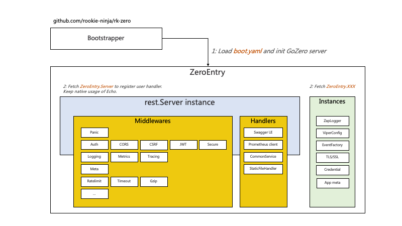

# Example
Middleware & bootstrapper designed for [zeromicro/go-zero](https://github.com/zeromicro/go-zero) web framework. 

## Documentation
- [Github](https://github.com/rookie-ninja/rk-zero)
- [Official Docs]() will be updated for v2 soon



## Installation
- rk-boot: Bootstrapper base
- rk-zero: Bootstrapper for [zeromicro/go-zero](https://github.com/zeromicro/go-zero)

```shell
go get github.com/rookie-ninja/rk-boot/v2
go get github.com/rookie-ninja/rk-zero
```

## Quick start
### 1.Create boot.yaml
```yaml
---
zero:
  - name: greeter                                          # Required
    port: 8080                                             # Required
    enabled: true                                          # Required
    commonService:
      enabled: true                                       # Optional, default: false
    sw:
      enabled: true                                        # Optional, default: false
    docs:
      enabled: true                                        # Optional, default: false
```

### 2.Create main.go
```go
package main

import (
	"context"
	"encoding/json"
	"fmt"
	"github.com/rookie-ninja/rk-boot/v2"
	"github.com/rookie-ninja/rk-zero/boot"
	"github.com/zeromicro/go-zero/rest"
	"net/http"
)

// @title Swagger Example API
// @version 1.0
// @description This is a sample rk-demo server.
// @termsOfService http://swagger.io/terms/

// @securityDefinitions.basic BasicAuth

// @contact.name API Support
// @contact.url http://www.swagger.io/support
// @contact.email support@swagger.io

// @license.name Apache 2.0
// @license.url http://www.apache.org/licenses/LICENSE-2.0.html

func main() {
	// Create a new boot instance.
	boot := rkboot.NewBoot()

	// Register handler
	zeroEntry := rkzero.GetZeroEntry("greeter")
	zeroEntry.Server.AddRoute(rest.Route{
		Method:  http.MethodGet,
		Path:    "/v1/greeter",
		Handler: Greeter,
	})

	// Bootstrap
	boot.Bootstrap(context.TODO())

	boot.WaitForShutdownSig(context.TODO())
}

// Greeter handler
// @Summary Greeter
// @Id 1
// @Tags Hello
// @version 1.0
// @Param name query string true "name"
// @produce application/json
// @Success 200 {object} GreeterResponse
// @Router /v1/greeter [get]
func Greeter(writer http.ResponseWriter, request *http.Request) {
	writer.WriteHeader(http.StatusOK)
	resp := &GreeterResponse{
		Message: fmt.Sprintf("Hello %s!", request.URL.Query().Get("name")),
	}
	bytes, _ := json.Marshal(resp)
	writer.Write(bytes)
}

type GreeterResponse struct {
	Message string
}
```

### 3.Start server

```go
$ go run main.go
```

### 4.Validation
- Call API:

```shell script
$ curl -X GET localhost:8080/v1/greeter?name=rk-dev
{"Message":"Hello rk-dev!"}

$ curl -X GET localhost:8080/rk/v1/ready
{
  "ready": true
}

$ curl -X GET localhost:8080/rk/v1/alive
{
  "alive": true
}
```

- Swagger UI: [http://localhost:8080/sw](http://localhost:8080/sw)


- Docs UI via: [http://localhost:8080/docs](http://localhost:8080/docs)


